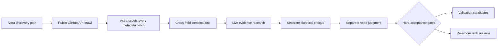

# Open Source Jigsaw

**Find unusual combinations of open source projects that deserve a real business experiment.**

Jigsaw searches broadly, connects technical ideas across unrelated fields, and asks **GPT-6 Astra** to investigate and judge the strongest hypotheses. A combination can contain **two to six projects**. The goal is a new capability or a meaningful economic advantage for a specific buyer—not a list of fashionable repositories.

**A run can finish with zero winners. The threshold never moves to fill a shortlist.**

**Continued research:** [Round two](research/round2/README.md) and [round three](research/round3/README.md) preserve executed prototypes, independent verification and failures. The MEP experiment found no qualifying advantage; its input-boundary defects are documented. [Round four](research/round4/README.md) adds real-model dbt and material-data screens and an executed [ultrasonic reconstruction experiment](experiments/ultrasonic-fmc/README.md): numerical controls passed, but its physical precheck failed and no timing comparison ran. [Round five](research/round5/README.md) screens measured machinery signals. [Round six](research/round6/README.md) holds scientific-data layout optimization and rejects a [font-corpus proposal](experiments/font-corpus/README.md) after an independently replayed baseline screen. [Round seven](research/round7/README.md) screens engineering acceptance workflows. [Round eight](research/round8/README.md) continues offline engineering planning. [Round nine](research/round9/README.md) investigates render-checked 3D asset delivery against current automatic tools. The [versioned pursuit rubric v2](docs/rubric-v2.md) distinguishes approval for a bounded validation experiment from proof of a business. It was frozen before formal round-two scoring; historical results and the original CLI gate remain v1. No v2 pass has been awarded yet.

## How it works



1. **Discover widely.** Astra creates 32 searches across at least 20 fields, including scientific and industrial software. The scraper gathers public repository metadata, adoption signals, topics, licenses, maintenance dates, and query provenance. Defaults retain up to 3,000 repositories with field-balanced selection.
2. **Look for transferable mechanisms.** Astra scouts batches of 80, then proposes combinations from mixed-field panels. Every component must serve a necessary role. Stars guide discovery; they do not establish buyer demand.
3. **Investigate deeply.** Astra uses live web research to inspect component documentation, licenses, existing alternatives, buyer workflows, pricing, technical interfaces, distribution, and economics. Missing facts remain explicit assumptions.
4. **Try to disprove it.** A fresh Astra session attacks novelty, commercial logic, and technical feasibility. Another fresh session makes the final judgment. These are separate contexts using the same model, not independent human opinions.
5. **Enforce the bar in code.** The model cannot overrule the deterministic acceptance gate. Every decision and rejection is saved as JSON, alongside a readable report.

The [initial Astra research](research/initial/research.md) captured **1,320 public repositories across 30 fields**, inspected **19 components** more closely, and evaluated **seven combinations**. **Zero passed**; weighted scores ranged from 54.5 to 65/100. It distinguishes the broad metadata crawl from the much smaller set inspected deeply. This separately conducted research is not represented as an end-to-end CLI run.

A separate [live CLI validation](research/live-validation/README.md) completed every stage on 57 repository candidates. Its three-project hypothesis was rejected at **44.5/100**. The generated report, structured decisions, and provenance are included; cached resume was also verified.

## Run locally

Requires **Python 3.11+**, authenticated [GitHub CLI](https://cli.github.com/), and a current [Codex CLI](https://learn.chatgpt.com/docs/non-interactive-mode) with access to [GPT-6 Astra](https://developers.openai.com/api/docs/models/gpt-6-astra).

```sh
git clone https://github.com/Milbaxter/opensource-jigsaw.git
cd opensource-jigsaw
python3 -m venv .venv
source .venv/bin/activate
python -m pip install -e '.[dev]'
gh auth login
codex login
jigsaw doctor
```

Start with a smaller run to inspect the workflow:

```sh
jigsaw run --out runs/first --per-query 10 --max-repos 300 \
  --candidates 2 --max-model-calls 20
```

For a broad sweep:

```sh
jigsaw run --out runs/broad --per-query 100 --max-repos 3000 \
  --candidates 16 --max-model-calls 100
```

For deeper coverage, increase `--per-query` up to GitHub Search's 1,000-result ceiling per query, add narrower searches to `plan.json`, and increase the model-call budget as needed. `--max-repos` caps the retained analysis catalogue; the crawler may retrieve more metadata while balancing fields. Search is not exhaustive and panels do not enumerate all possible combinations.

Separate stages are available:

```sh
jigsaw discover --out runs/broad
jigsaw analyze --out runs/broad --candidates 16 --max-model-calls 100
jigsaw report --out runs/broad
```

`discover` creates an Astra plan if none exists. You can edit `plan.json` before another discovery pass. Plans must contain 16–64 queries spanning at least 12 distinct field labels. Use valid GitHub Search syntax; the collector adds public/non-fork/non-archived restrictions and also filters returned metadata.

## The CLI acceptance bar (v1)

| Dimension | Weight | Required minimum / 10 |
| --- | ---: | ---: |
| Novel cross-field synergy | 20% | 9 |
| Buyer pain | 20% | 8 |
| Willingness to pay | 15% | 8 |
| Technical feasibility | 15% | 8 |
| Defensibility | 10% | 7 |
| Distribution | 10% | 7 |
| Evidence quality | 10% | 8 |

**All** of these must hold:

- Weighted score **≥85/100**, every dimension above its floor, confidence **≥0.80**, and Astra's verdict is `pursue`.
- Two to six distinct, actually discovered components originating in at least two discovery fields. Astra must also judge whether the fields are substantively different.
- Verified demand, differentiation, integration, and compatible licensing under the proposed business model.
- At least two external demand/pricing sources on different hostnames, plus competitor, technical, and license evidence.
- No unresolved critical assumption and no fatal flaw from either critic or judge.
- Every component's detected license passes a conservative known-license screen. Unknown and `NOASSERTION` licenses block acceptance pending verification.

Source presence and hostnames are mechanically checked; source truth, independence, substantive novelty, and license compatibility are model assessments that need human scrutiny. Two websites are not proof of two independent measurements. A pass means **worth testing**, not proven profitable. See [the research rubric](docs/rubric.md).

## Executed-evidence pursuit reviews (v2)

For a candidate with a preregistered executed experiment, use the separate [v2 rubric](docs/rubric-v2.md): score ≥80, per-dimension floors, confidence ≥0.75, and all seven evidence gates. Artifact hashes, exact component rights, the comparison, input access and capped next experiment are required. Historical v1 results are not rescored, and `jigsaw run` still uses its original v1 gate.

```sh
jigsaw assess --review path/to/review.json --evidence-root . --out runs/assessment
```

A technical integration alone cannot pass. The [research lessons](docs/research-lessons.md) explain how failed experiments improve subsequent search and comparison choices without changing thresholds to produce a winner.

## Outputs and resuming

Each run directory contains:

| File | Purpose |
| --- | --- |
| `plan.json` | Astra's search queries and rationale |
| `catalog.json` | Deduplicated repository metadata and provenance |
| `crawl.json` | Search pages, timestamps, totals, and incomplete-result flags |
| `shortlist.json` | Components chosen for combination design |
| `proposals.json` | Unvalidated product hypotheses |
| `results.json` | Research, critique, judgment, and enforced decision |
| `accepted.json` | Only combinations clearing every gate |
| `summary.json` | Counts and `partial` / `complete` analysis status |
| `report.md` | Human-readable winners, rejections, and source links |

GitHub responses and validated model outputs are cached locally. Rerunning the same command resumes by reusing cached work. Schema, prompt, model, reasoning, or input changes invalidate model cache keys. Each analysis clears the current summary to `partial` before work begins; failed runs never claim to have completed. Historical decision files remain available, while `results.json` describes the current analysis.

A run directory is a snapshot. Use a **new `--out` directory for fresh evidence**, even on the same day. Default output is `runs/YYYY-MM-DD`. Cached GitHub timestamps retain the original retrieval time. Concurrent processes must use different output directories.

## Usage, boundaries, and limits

- All model stages explicitly request `gpt-6-astra` with high reasoning. There is no silent substitute model. Astra access is verified by the first call; `doctor` checks tools and login only.
- The CLI uses your local Codex authentication. It does not read or copy credentials. GitHub uses `GH_TOKEN`, `GITHUB_TOKEN`, or `gh auth token`; the collector only makes public REST reads.
- `--max-model-calls` limits new calls **per invocation**, not tokens or dollars. Live research can be expensive and slow. Check your own account usage; a full sweep can take hours. Cached calls do not consume this counter. Default timeout is 900 seconds per model call.
- CLI model stages run in fresh read-only Codex sessions with shell, app, browser/computer-control, hooks, and delegation features disabled. Built-in web search is enabled only for due diligence. Repository metadata and webpages are treated as untrusted evidence; fetched repository code is never installed or executed.
- GitHub rate limits receive bounded retries. Exhaustion, malformed model output, missing tools, and permission failures stop with an actionable error. Search truncation is recorded rather than presented as complete coverage.
- Discovery includes public candidates whose open source status is unverified. Unknown licensing blocks a pass. The project's MIT license covers Jigsaw application code. Experiment source can carry an explicit directory-level license; ultrasonic benchmark source is designated GPL-3.0-or-later. Third-party projects and data retain their own terms.
- This repository schedules no paid research jobs automatically. CI runs offline tests and builds without model credentials. Run the CLI when you want another sweep.

## Development

```sh
ruff check .
ruff format --check .
pytest -q
python -m build
```

Tests cover adversarial acceptance gates, multi-project combinations, pagination, provenance, field balancing, caching, rate-limit recovery, budget exhaustion, malformed output, and partial runs. Model/network calls are mocked in CI. Test fixtures are synthetic and are never reported as research findings.

Contributions that improve evidence quality, field coverage, or falsification are particularly useful. See [CONTRIBUTING.md](CONTRIBUTING.md). Jigsaw application code is MIT licensed; respect explicit experiment and third-party license notices.
