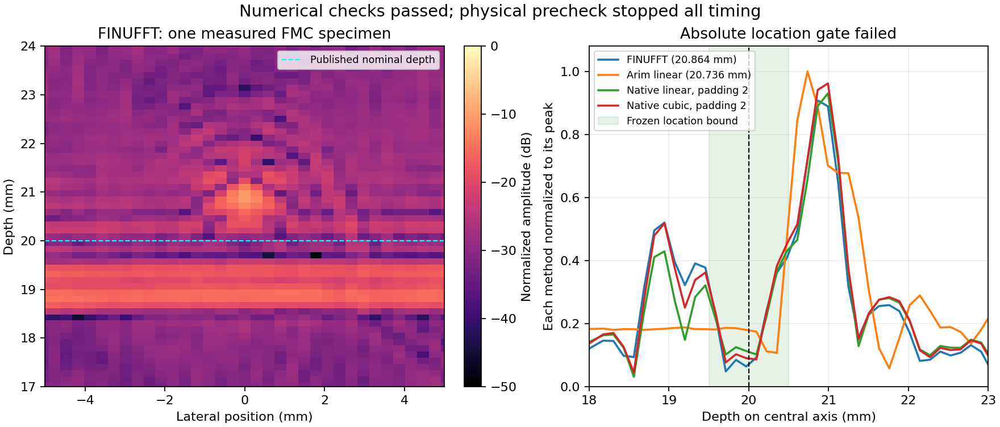

# Ultrasonic FMC interpolation experiment: physical precheck failed

**HOLD. Numerical integration worked, but the preregistered physical-location gate failed. No timed performance evaluation ran.** This original outcome is preserved without calibration, threshold changes or depth adjustment. It is not a validation-ready business, an inspection qualification or a profitability finding.

Protocol was published before implementation in commit `4fc6057fb027cee066700076c6e39ef17622a57f`, SHA-256 `39efd6e39d50c3a98ff57c2d27196b3f7175e9c8cd132ac2315b0f0a44d3a646`. Executed prototype SHA-256 is `e1f9067cb7dbdba218ea3c0b9f26facf47dc1c3516b7780c727589d34a682e02`; driver is `e7c61a428792df36c13c4b495653ddce4358a0e24bc456888ec1e40fb36bb863`. Exact bytes and freeze records accompany this report.

## What ran

An original measured 64-element, 4,096-pair ultrasonic full-matrix capture was loaded through unmodified Arim. A Python implementation of the published DCWA formulation constructed a **chosen canonical periodic interpolant of a sampled, pre-masked spectrum**. FINUFFT evaluated that polynomial; native-order FFT interpolation and accelerated Arim delay-and-sum supplied separate practical comparisons. The canonical polynomial is a numerical target, not unique physical truth.

The input is Velichko and Croxford's CC BY 4.0 [measured 1 mm side-drilled-hole dataset](https://doi.org/10.6084/m9.figshare.7178630), published with [the 2018 experiment](https://pmc.ncbi.nlm.nih.gov/articles/PMC6237505/). The source states a 20 mm hole depth and the array directly above it. Metadata gives 6,400 m/s, 5 MHz, 0.6 mm pitch and 25 MHz sampling. Direct download succeeded: 1,869,782 bytes, valid MATLAB header, MD5 matching publisher metadata and SHA-256 `b244d0e800087590da0664ef97473494dc6ef38a683ec80f262af307c8c37b89`. Exact original data are downloaded by `fetch-input.py`; no proprietary customer data or third-party software binary is bundled.

| Outcome | Original result |
|---|---:|
| Frozen numerical/input/origin controls | **159/159 passed** |
| Candidate canonical image-quality checks | **9/9 passed** |
| Actual measured specimens | **1** |
| Parameter reprocessings per method | 9 velocities |
| Reference/candidate/Arim/native diagnostic images | 54 total |
| Repeated timed performance batches | **0** |
| Resource-censored or unexpectedly errored subprocesses | 0 |
| Driver final status | 2: intended stop on failed physical precheck |

The 54 images are six methods × nine velocity settings on the same measured data, not 54 independent physical trials. Methods are high-accuracy FINUFFT reference, candidate FINUFFT, Arim nearest, Arim linear, native linear/padding2 and native cubic/padding2. All remaining registered performance methods were **not attempted because the prerequisite failed**, not selectively omitted after timing.

## Why the physical gate failed

At the stated 6,400 m/s:

| Method | Dominant lateral coordinate | Dominant depth | Offset from nominal 20 mm |
|---|---:|---:|---:|
| FINUFFT candidate | 0.000 mm | 20.864 mm | +0.864 mm |
| High-accuracy same-target reference | 0.000 mm | 20.864 mm | +0.864 mm |
| Arim nearest | 0.000 mm | 20.736 mm | +0.736 mm |
| Arim linear | 0.000 mm | 20.736 mm | +0.736 mm |

The registered bound was 0.5 mm from the stated target. Candidate and Arim differ by only one axial grid step, 0.128 mm, but **agreement with Arim does not override the independently declared absolute-location requirement**. The canonical candidate's relative complex-image error at this velocity was approximately `3.12e-7` against the high-accuracy reference. That establishes faithful numerical evaluation of the chosen polynomial, not correct defect localization.

A common acquisition/pulse timing offset, or an unmodeled distinction between physical hole position and the chosen signal-envelope location, is a possible explanation. It has **not** been established. The input time axis starts at zero. The `delays` matrix accompanies plane-wave steering angles and was not treated as a calibrated hardware timing correction. No delay was fitted from the known 20 mm target. A new experiment would require independent timing/calibration evidence and a new prospective protocol; this result remains a failure.

Native-order DCWA and Arim images/profiles remain included even though their absolute complex amplitudes are not those of the canonical reference. They are not excluded merely for failing the canonical 1% metric. See `execution/summary.json` for every image error, target location, connected main-lobe width, profile and off-target response.

## Static review and deviations

Before any algorithm execution, independent review found that an initial draft placed origin phases after interpolation, used a translation check that canceled its own phase error, wrapped the native interpolation boundary, and measured the span of all above-half-height peaks rather than a connected main lobe. That **unexecuted** draft and its initial hash record are retained. The fixes conformed to the already published protocol; final source hashes were recorded before the first import/control/reconstruction. No evaluated outcome was altered retrospectively.

No algorithm, input, grid, accuracy threshold, target location, velocity list or stopping condition was changed after execution began. The finite driver withheld timing after the failed physical check, retained two native diagnostic batches, and exited with the intended gate-failure status. A separate invocation of the frozen summary command incorporated those final native diagnostics; the earlier precheck summary remains preserved.

The implementation adapts the published DCWA formulation and processing order with explicit physical coordinate conventions and a fixed image grid. It is **not** claimed to be a bit-identical execution of the original MATLAB program. The direct-sum controls independently check numerical evaluation; a separate reviewer is reproducing source/image calculations. Independent review reproduced four 6,400 m/s images bit-identically and passed 15 separate direct-sum queries; its separate report is `work/ultrasonic-independent-review/POST-RESULT-REVIEW.md`. It found no source-based timing correction. It also noted that the shared acquisition object prepares a transmit FFT even for Arim, which does not need it. Therefore any future cold-cost comparison must remove or charge that preparation appropriately; no such performance claim is made from this stopped run. Read the independent report separately from this proposer report.

## Practical interpretation and next decision

The original purchased-deliverable hypothesis was a maintained offline Python reconstruction backend for an existing NDT method-development workflow, with a material end-to-end CPU or memory advantage. This experiment did not reach that trade-off evaluation. Per-stage wall-clock observations from quality diagnostics are retained for provenance, but they are not the registered repeated timing comparison and must not be advertised as a speed-up.

Existing CIVA, Eddyfi and TWI workflows already provide advanced/fast reconstruction. The remaining business questions include whether real customers retain/export elementary data, whether their meaningful jobs fit this restricted propagation model, whether their incumbent actually leaves a bottleneck, and whether a maintained integration has paid repeat value. None is answered by a small Fourier error. The proposed three-organization acquisition/economic test was not performed; no outreach, sale or buyer validation is claimed.

Hold this candidate unless the independent source-only diagnosis establishes a principled acquisition-model correction. Otherwise move to the reserved real encoder-ground-truth machinery lead. Do not loosen the absolute gate to obtain a pass, and do not confuse this technical hold with proof that Fourier methods lack commercial usefulness.

## Rights and reproduction

The benchmark source is GPL-3.0-or-later. Arim is MIT; the adapted DCWA reference is BSD-3-Clause, with notices retained. FINUFFT's main source is Apache-2.0, but the exact measured macOS wheel contains GPL-2.0-or-later FFTW and must not be described as Apache-only or ready for closed-source binary distribution. No dependency binary is published. See `rights-notes.md`, `rights-inspection.json`, `THIRD-PARTY-NOTICES.md` and `execution-provenance.json`.

In a separate checkout/environment, install the pinned dependencies, run `python fetch-input.py`, then `python run_frozen.py` using the experiment's `.venv` layout. Running again writes a new execution record; copy the published original results first. The official source-only command records and local-path redaction note are preserved in the publication packet.
